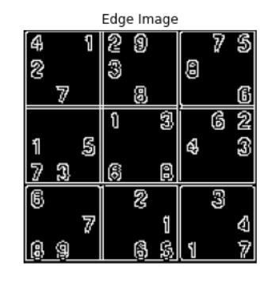

# Edge-Linking-using-Hough-Transform
## Aim:
To write a Python program to detect the lines using Hough Transform.

## Software Required:
Anaconda - Python 3.7

## Algorithm:
Step1:
Import the required modules.

Step2:
Import the image to operate on.

Step3:
Convert the imported image from BGR to GRAYSCALE.

Step4:
Find the edges using canny edge detector and display the image.

Step5:
Detect the points that form a line using hough transform.

Step6:
Draw the lines on the image

Step7:
Display the output

Step8:
End the program.


## Program:
```Python

# Read image and convert it to grayscale image

import numpy as np
import matplotlib.pyplot as plt
import cv2
image = cv2.imread("p1.jpg",0)
img = cv2.GaussianBlur(image,(3,3),0)
plt.axis('off')
plt.imshow(img)
plt.show()

# Find the edges in the image using canny detector and display

edge = cv2.Canny(img,100,200)
plt.imshow(edge,cmap='gray')
plt.title('Edge Image')
plt.xticks([])
plt.yticks([])
plt.show()

# Detect points that form a line using HoughLinesP

lines=cv2.HoughLinesP(edge,1,np.pi/180, threshold=80, minLineLength=50,maxLineGap=250)


# Draw lines on the image

for line in lines:
    x1,y1,x2,y2 = line[0]
    cv2.line(edge,(x1,y1),(x2,y2),(255,0,0),3)
    
# Display the result

plt.imshow(edge)
plt.axis('off')
plt.show()


```
## Output

### Input image and grayscale image


### Canny Edge detector output



### Display the result of Hough transform


## Result:
Thus the program is written with python and OpenCV to detect lines using Hough transform. 
